# margin 合并还是不合并,这是一个问题.

本文讨论了在不同条件下的 margin 合并的 ~~bug~~ feature

html 结构如下

```html
<ul>
  <li>Lorem ipsum dolor sit amet, consectetur adipisicing elit. Est quaerat alias nobis totam, animi veniam, quibusdam expedita impedit error, eligendi quis iste accusantium, reprehenderit sed ipsa voluptates a porro ratione.</li>
  <li>Lorem ipsum dolor sit amet, consectetur adipisicing elit. Debitis harum eum distinctio provident voluptatem magnam ad eligendi odit earum laborum minima, blanditiis quos adipisci tenetur vero obcaecati impedit quod cum.</li>
  <li>Lorem ipsum dolor sit amet, consectetur adipisicing elit. Quidem labore libero perspiciatis mollitia dolores quasi amet incidunt, accusantium odit saepe, tempora vel rerum debitis qui, sint, sapiente esse error maxime!</li>
</ul>
<!-- 下面的 h1 标签是为了方便测量  -->
<h1>
  Lorem<br>
  Lorem<br>
  Lorem
</h1>
```
css 如下
```css
/* 为保证在所有浏览器下效果一致 */
* {
    margin: 0;
    padding: 0;
}
```

## 一. 从最简单的情况开始讨论--父子嵌套 margin

### 1.1 父( ul )子( li )同时设置了 margin-bottom, 且 ul 未设置 border

(**注意!** 此时的 ul 边距的定义: ul 的 content-area 区域下边线到 h1 content-area 区域 上边线的距离, 下面简称为 ul-margin)

(**注意!** 此时的 li 边距的定义: li content-area 区域下边线到 h1 content-area 区域 上边线的距离, 下面简称为 li-margin)

(**注意!** 此时这两个边距是等效的)

#### (1) 都是正数(即两个 margin-bottom 都是正值)

```css
ul {
    background-color: rgba(0,0,0,0.3);
    margin-bottom: 50px;
}

li {
    background-color: rgba(256,0,0,0.1);
    margin-bottom: 20px;
}

h1 {
    background-color: rgba(0,256,0,0.3);    
}
```

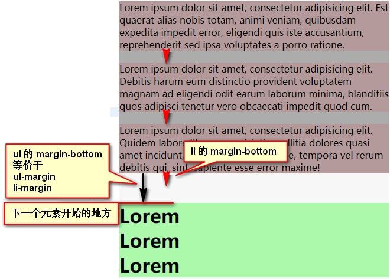

    由于 50 > 20 所以合并后 ul-margin 为 50

#### (2) ul 的 margin-bottom 为正, li 的 margin-bottom 为负

```css
ul {
    background-color: rgba(0,0,0,0.3);
    margin-bottom: 50px;
}

li {
    background-color: rgba(256,0,0,0.1);
    margin-bottom: -20px;
}

h1 {
    background-color: rgba(0,256,0,0.3);
}
```


    由于 20 + (-50) = -30 所以合并后 ul-margin 为 -30

#### (3) ul 的 margin-bottom 为负, li 的 margin-bottom 为正

```css
ul {
    background-color: rgba(0,0,0,0.3);
    margin-bottom: -50px;
}

li {
    background-color: rgba(256,0,0,0.1);
    margin-bottom: 20px;
}

h1 {
    background-color: rgba(0,256,0,0.3);
}
```

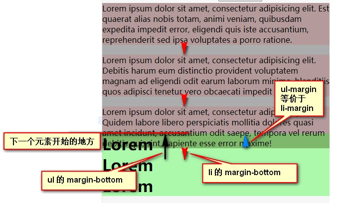

    由于 20 + (-50) = -30 所以合并后 ul-margin 为 -30

#### (4) 都是负数

```css
ul {
    background-color: rgba(0,0,0,0.3);
    margin-bottom: -50px;
}

li {
    background-color: rgba(256,0,0,0.1);
    margin-bottom: -20px;
}

h1 {
    background-color: rgba(0,256,0,0.3);
}
```

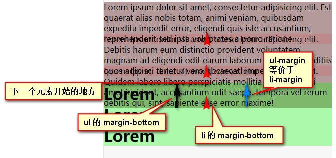

    由于 |-50| > |-20|, 所以合并后的 ul-margin 为 -50px

小结:

    当父( ul )子( li )同时设置了 margin-bottom 时
    1. 如果符号相同(即同时为正,或同时为负), ul-margin(li-margin) 取绝对值大的那个
    2. 如果符号不同(即一正一负), ul-margin(li-margin) 取两者之和

    ul-margin(li-margin) = 
        MAX(如果|ul 的 margin-bottom|正, 如果|li 的 margin-bottom|正) + 
        MAX(如果|ul 的 margin-bottom|负, 如果|li 的 margin-bottom|负)

### 1.2 父( ul )子( li )同时设置了 margin-bottom, 且 ul 设置了 border

(**注意!** 此时的 ul 边距的定义: border 下边线到 h1 content-area 区域 上边线的距离, 下面简称为 ul-margin)

(**注意!** 此时的 li 边距的定义: li content-area 区域下边线到 h1 content-area 区域 上边线的距离, 下面简称为 li-margin)

(**注意!** 此时ul-margin 和 li-margin 两个边距 "不" 是等效的)

#### (1) 都是正数, 且 ul 有 border

```css
ul {
    background-color: rgba(0,0,0,0.3);
    margin-bottom: 50px;
    border: 5px solid yellow;
}

li {
    background-color: rgba(256,0,0,0.1);
    margin-bottom: 20px;
}

h1 {
    background-color: rgba(0,256,0,0.3);
}
```

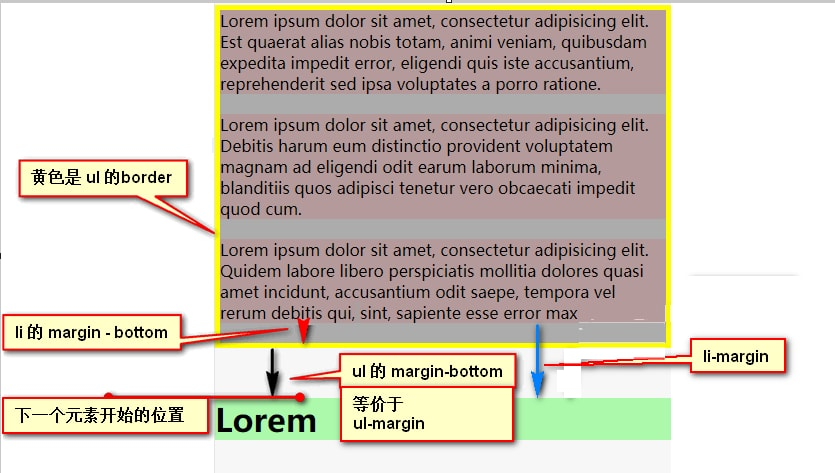

    50 > 20 所以
    此时的 ul-margin = ul 的 margin-bottom = 50
    此时的 li-margin = li 的 margin-bottom + ul 的 border + ul 的 margin-bottom = 50 + 5 +20 = 75

#### (2) ul 的 margin-bottom 为正, li 的 margin-bottom 为负, 且 ul 有 border

```css
ul {
    background-color: rgba(0,0,0,0.3);
    margin-bottom: 50px;
    border: 5px solid yellow;
}

li {
    background-color: rgba(256,0,0,0.1);
    margin-bottom: -20px;
}

h1 {
    background-color: rgba(0,256,0,0.3);
}
```
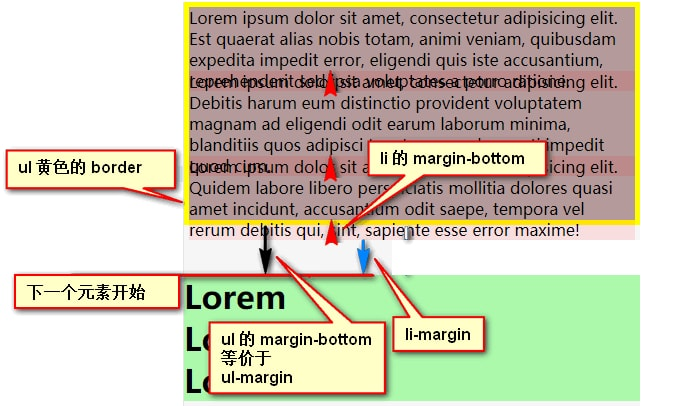

    由于一正一负 所以

    此时的 ul-margin = ul 的 margin-bottom = 50
    此时的 li-margin = li 的 margin-bottom + ul 的 border + ul 的 margin-bottom = (-20) + 5 + 50 = 35

#### (3) ul 的 margin-bottom 为负, li 的 margin-bottom 为正, 且 ul 有 border

```css
ul {
    background-color: rgba(0,0,0,0.3);
    margin-bottom: -50px;
    border: 5px solid yellow;
}

li {
    background-color: rgba(256,0,0,0.1);
    margin-bottom: 20px;
}

h1 {
    background-color: rgba(0,256,0,0.3);
}
```
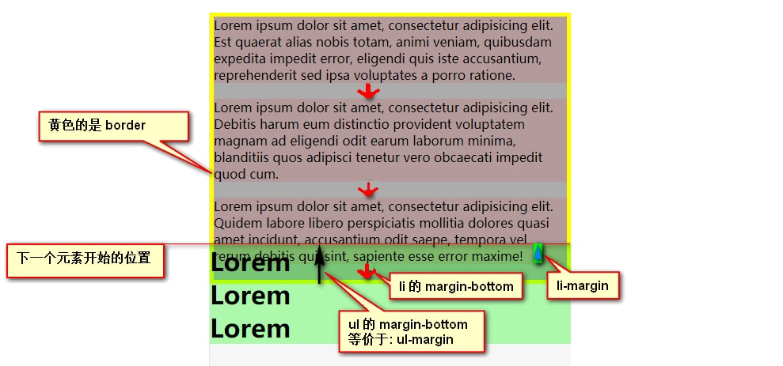

    由于一正一负 所以

    此时的 ul-margin = ul 的 margin-bottom = -50
    此时的 li-margin = li 的 margin-bottom + ul 的 border + ul 的 margin-bottom = -50 + 5 +20 = -25


#### (4) 都是负数, 且 ul 有 border

```css
ul {
    background-color: rgba(0,0,0,0.3);
    margin-bottom: -50px;
    border: 5px solid yellow;
}

li {
    background-color: rgba(256,0,0,0.1);
    margin-bottom: -20px;
}

h1 {
    background-color: rgba(0,256,0,0.3);
}
```

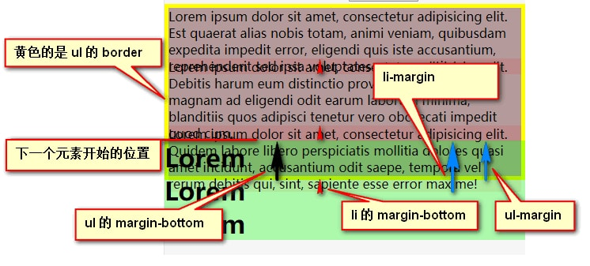

    由于 |-50| > |-20| 所以

    此时的 ul-margin = ul 的 margin-bottom = -50
    此时的 li-margin = li 的 margin-bottom + ul 的 border + ul 的 margin-bottom = -50 + 5 - 20 = -65

小结:

    当父( ul )子( li )同时设置了 margin-bottom 时, 且 ul 设置了 border
    1. ul-margin = ul 的 margin-bottom(忽略 border 和 li-bottom)
    2. li-margin = li 的 margin-bottom + ul 的 border + ul 的 margin-bottom

```
归纳为:
    一. 当父( ul )子( li )同时设置了 margin-bottom 时
        1. 如果符号相同(即同时为正,或同时为负), ul-margin(li-margin) 取绝对值大的那个
        2. 如果符号不同(即一正一负), ul-margin(li-margin) 取两者之和

    二. 当父( ul )子( li )同时设置了 margin-bottom 时, 且 ul 设置了 border
        1. ul-margin = ul 的 margin-bottom(忽略 border 和 li-bottom)
        2. li-margin = li 的 margin-bottom + ul 的 border + ul 的 margin-bottom
```

## 二. 再讨论复杂一点的情况--父子嵌套 margin + 兄弟元素 margin

### 2.1 父( ul )子( li )同时设置了 margin-bottom, ul 未设置 border, 兄弟元素( h1 )设置了 margin-top

(**注意!** 此时这 ul-margin 和 li-margin 两个边距是等效的)

#### (1) 都是正数(即 ul 和 li 的 margin-bottom, 以及 h1 的 margin-top 是正值)

```css
ul {
    background-color: rgba(0,0,0,0.3);
    margin-bottom: 50px;
}

li {
    background-color: rgba(256,0,0,0.1);
    margin-bottom: 20px;
}

h1 {
    background-color: rgba(0,256,0,0.3);    
    margin-top: 30px;
}
```

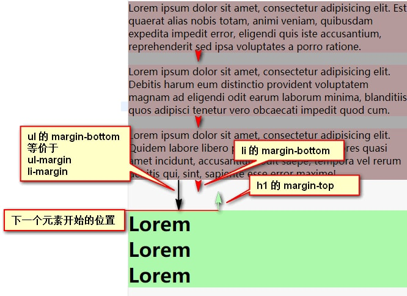

    由于 50 > 20 所以 先取 50
    50 > 30 所以 ul-margin 为 50

#### (2) ul 和 li 的 margin-bottom 为正数, h1 的 margin-top 是负数

```css
ul {
    background-color: rgba(0,0,0,0.3);
    margin-bottom: 100px;
}

li {
    background-color: rgba(256,0,0,0.1);
    margin-bottom: 20px;
}

h1 {
    background-color: rgba(0,256,0,0.3);    
    margin-top: -50px;
}
```

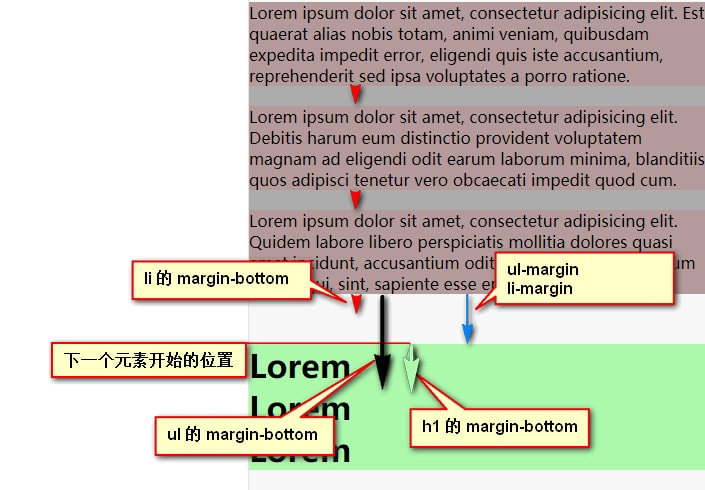

    由于 100 > 20 所以 先取 100
    100 + (-50) = 50 所以 ul-margin 为 50
    
#### (3) ul 的 margin-bottom 为正, li 的margin-bottom 为负 , h1 的 margin-top 是正数

h1 的 margin-top 为正值

```css
ul {
    background-color: rgba(0,0,0,0.3);
    margin-bottom: 100px;
}

li {
    background-color: rgba(256,0,0,0.1);
    margin-bottom: -20px;
}

h1 {
    background-color: rgba(0,256,0,0.3);    
    margin-top: 50px;
}
```

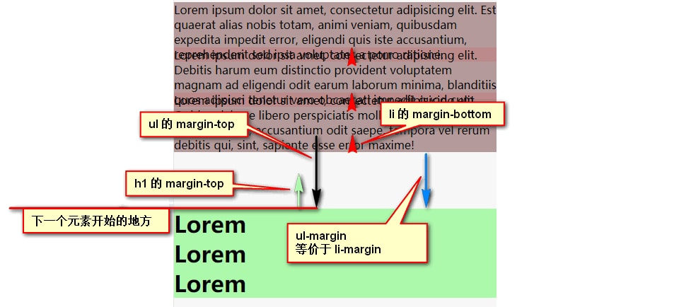

    由于 100 > 50 取 100
    100 + (-20) = 80 所以 ul-margin 为 80

#### (4) ul 的 margin-bottom 为正, li 的margin-bottom 为负 , h1 的 margin-top 是负数

```css
ul {
    background-color: rgba(0,0,0,0.3);
    margin-bottom: 100px;
}

li {
    background-color: rgba(256,0,0,0.1);
    margin-bottom: -20px;
}

h1 {
    background-color: rgba(0,256,0,0.3);    
    margin-top: -50px;
}
```

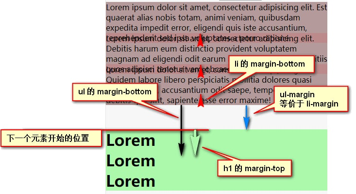

    由于 |-50| > |-20| 取 -50
    100 + (-50) = 50 所以 ul-margin 为 50

#### (5) ul 的 margin-bottom 为负, li 的margin-bottom 为正 , h1 的 margin-top 是正数

```css
ul {
    background-color: rgba(0,0,0,0.3);
    margin-bottom: -100px;
}

li {
    background-color: rgba(256,0,0,0.1);
    margin-bottom: 20px;
}

h1 {
    background-color: rgba(0,256,0,0.3);    
    margin-top: 50px;
}
```

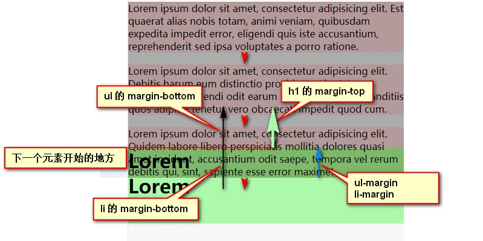

    由于 50 > 20 取 50
    50 + (-100) = -50  所以 ul-margin 为 -50


#### (6) ul 的 margin-bottom 为负, li 的margin-bottom 为正 , h1 的 margin-top 是负数

```css
ul {
    background-color: rgba(0,0,0,0.3);
    margin-bottom: -100px;
}

li {
    background-color: rgba(256,0,0,0.1);
    margin-bottom: 20px;
}

h1 {
    background-color: rgba(0,256,0,0.3);    
    margin-top: -50px;
}
```

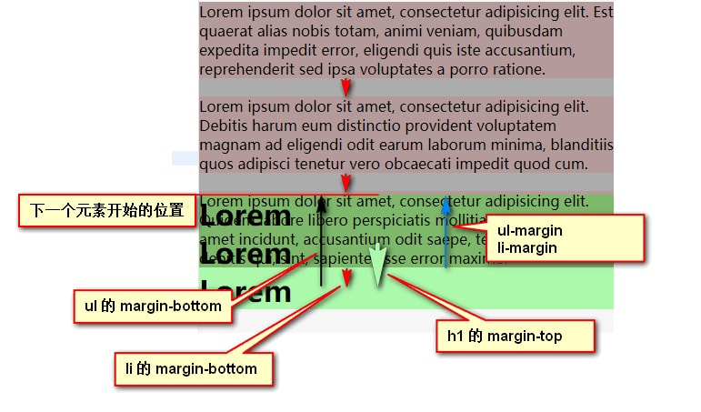

    |-100| > |-50| 取 -100
    (-100) + 20 = -80 所以 ul-margin 为 80

#### (7) ul 和 li 的 margin-bottom 都是负数, h1 的 margin-top 是正数

```css
ul {
    background-color: rgba(0,0,0,0.3);
    margin-bottom: -50px;
}

li {
    background-color: rgba(256,0,0,0.1);
    margin-bottom: -20px;
}

h1 {
    background-color: rgba(0,256,0,0.3);
    margin-top: 80px;
}
```

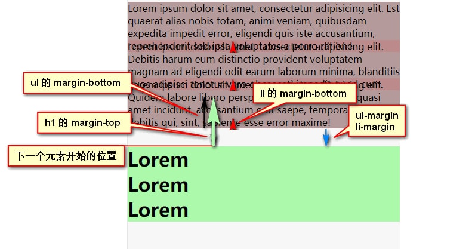

    |-50| > |-20| 取 -50
    (-50) + 80 = 30 所以 ul-margin 为 30

#### (8) 都是负数(ul 和 li 的 margin-bottom 以及 h1 的 margin-top 都是负数)

```css
ul {
    background-color: rgba(0,0,0,0.3);
    margin-bottom: -50px;
}

li {
    background-color: rgba(256,0,0,0.1);
    margin-bottom: -20px;
}

h1 {
    background-color: rgba(0,256,0,0.3);
    margin-top: -80px;
}
```

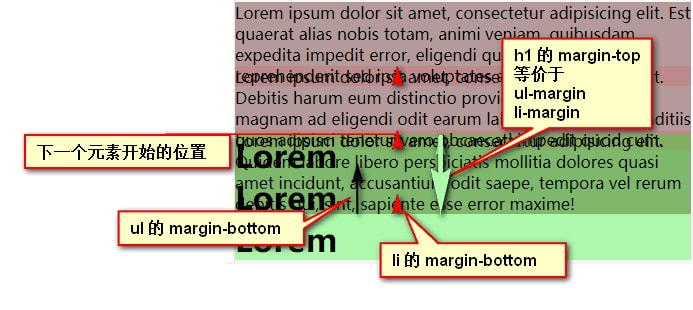

    因为 |-50| > |-20| 取 -50
    |-50| < |-80| ul-margin 取 -80
    
小结:

    当父( ul )子( li )同时设置了 margin-bottom 时, 兄弟元素( h1 )设置了 margin-top
    1. 如果正负相同(即同时为正,或同时为负)
        ul-margin(li-margin) = MAX(|ul 的 margin-bottom|, |li 的 margin-bottom|, |h1 的 margin-bottom|)
    2. 如果 ul li, h1 的正负不同
        ul-margin(li-margin) = MAX(如果|ul 的 margin-bottom|正的, 如果|li 的 margin-bottom|正的, 如果|h1 的 margin-bottom|正的) + MAX(如果|ul 的 margin-bottom|负的, 如果|li 的 margin-bottom|负的, 如果|h1 的 margin-bottom|负的)

### 2.2 父( ul )子( li )同时设置了 margin-bottom, 且 ul 设置了 border, 兄弟元素( h1 )设置了 margin-top

(**注意!** 此时ul-margin 和 li-margin 两个边距 "不" 是等效的)

#### (1) 都是正数(即 ul 和 li 的 margin-bottom, 以及 h1 的 margin-top 是正值)

```css
ul {
    background-color: rgba(0,0,0,0.3);
    margin-bottom: 50px;
    border: 5px solid yellow;
}

li {
    background-color: rgba(256,0,0,0.1);
    margin-bottom: 20px;
}

h1 {
    background-color: rgba(0,256,0,0.3);    
    margin-top: 30px;
}
```

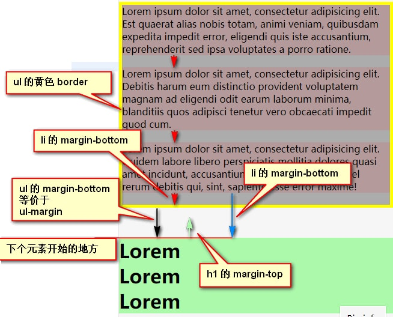

    因为 ul 的 margin-bottom > h1 的 margin-top 所以 ul-margin 为 50
    li-margin = ul 的 margin-bottom + ul 的 border + li 的 margin-bottom = 75

#### (2) ul 和 li 的 margin-bottom 为正数, h1 的 margin-top 是负数

```css
ul {
    background-color: rgba(0,0,0,0.3);
    margin-bottom: 100px;
    border: 5px solid yellow;
}

li {
    background-color: rgba(256,0,0,0.1);
    margin-bottom: 20px;
}

h1 {
    background-color: rgba(0,256,0,0.3);    
    margin-top: -50px;
}
```

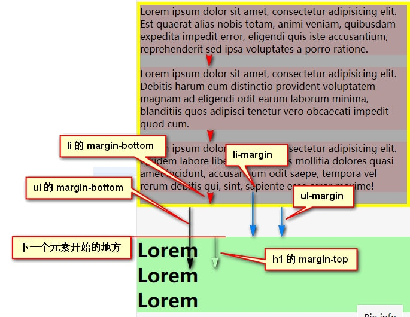

    因为 ul 的 margin-bottom + h1 的 margin-top = 50 所以 ul-margin 为 50
    li-margin = ul 的 margin-bottom + ul 的 border + li 的 margin-bottom + h1 的 margin-top = 75
    
#### (3) ul 的 margin-bottom 为正, li 的margin-bottom 为负 , h1 的 margin-top 是正数

h1 的 margin-top 为正值

```css
ul {
    background-color: rgba(0,0,0,0.3);
    margin-bottom: 100px;
    border: 5px solid yellow;
}

li {
    background-color: rgba(256,0,0,0.1);
    margin-bottom: -20px;
}

h1 {
    background-color: rgba(0,256,0,0.3);    
    margin-top: 50px;
}
```

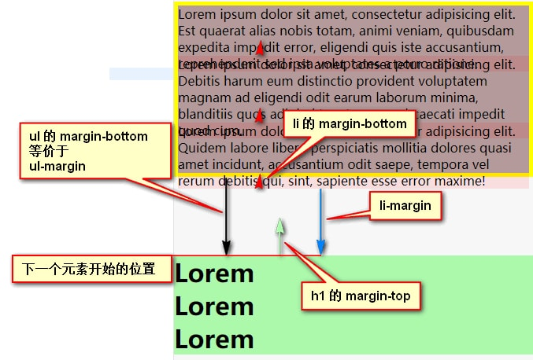

    因为 ul 的 margin-bottom > h1 的 margin-top 所以 ul-margin 为 100
    li-margin = ul 的 margin-bottom + ul 的 border + li 的 margin-bottom = 85

#### (4) ul 的 margin-bottom 为正, li 的margin-bottom 为负 , h1 的 margin-top 是负数

```css
ul {
    background-color: rgba(0,0,0,0.3);
    margin-bottom: 100px;
    border: 5px solid yellow;
}

li {
    background-color: rgba(256,0,0,0.1);
    margin-bottom: -20px;
}

h1 {
    background-color: rgba(0,256,0,0.3);    
    margin-top: -50px;
}
```

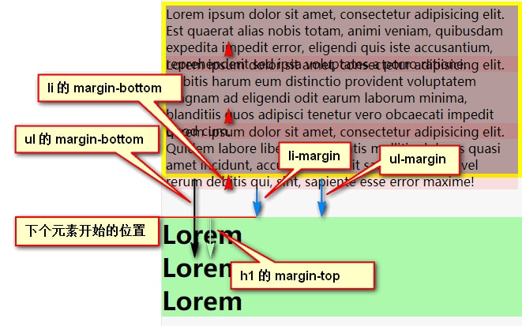

    因为 ul 的 margin-bottom + h1 的 margin-top = 50 所以 ul-margin 为 50
    li-margin = ul 的 margin-bottom + ul 的 border + li 的 margin-bottom + h1 的 margin-top = 35

#### (5) ul 的 margin-bottom 为负, li 的margin-bottom 为正 , h1 的 margin-top 是正数

```css
ul {
    background-color: rgba(0,0,0,0.3);
    margin-bottom: -100px;
    border: 5px solid yellow;
}

li {
    background-color: rgba(256,0,0,0.1);
    margin-bottom: 20px;
}

h1 {
    background-color: rgba(0,256,0,0.3);    
    margin-top: 50px;
}
```

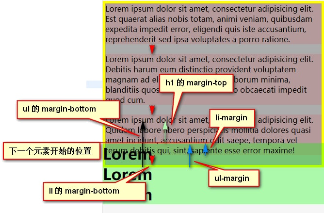

    因为 ul 的 margin-bottom + h1 的 margin-top = -50 所以 ul-margin 为 -50
    li-margin = ul 的 margin-bottom + ul 的 border + li 的 margin-bottom + h1 的 margin-top = -25

#### (6) ul 的 margin-bottom 为负, li 的margin-bottom 为正 , h1 的 margin-top 是负数

```css
ul {
    background-color: rgba(0,0,0,0.3);
    margin-bottom: -100px;
    border: 5px solid yellow;
}

li {
    background-color: rgba(256,0,0,0.1);
    margin-bottom: 20px;
}

h1 {
    background-color: rgba(0,256,0,0.3);    
    margin-top: -50px;
}
```

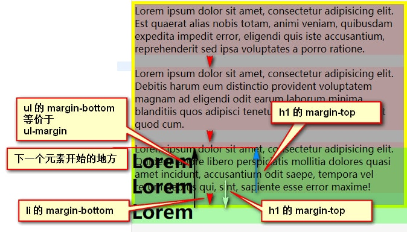

    因为 |ul 的 margin-bottom| > |h1 的 margin-top| = -50 所以 ul-margin 为 -100
    li-margin = ul 的 margin-bottom + ul 的 border + li 的 margin-bottom = -75


#### (7) ul 和 li 的 margin-bottom 都是负数, h1 的 margin-top 是正数

```css
ul {
    background-color: rgba(0,0,0,0.3);
    margin-bottom: -50px;
    border: 5px solid yellow;
}

li {
    background-color: rgba(256,0,0,0.1);
    margin-bottom: -20px;
}

h1 {
    background-color: rgba(0,256,0,0.3);
    margin-top: 80px;
}
```

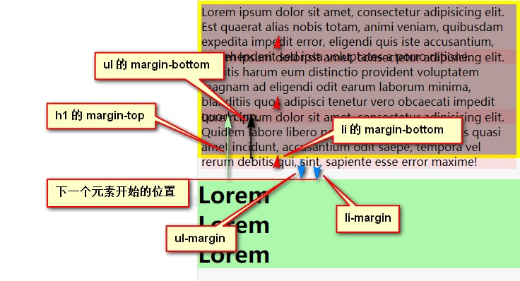

    因为 ul 的 margin-bottom + h1 的 margin-top = 30 所以 ul-margin 为 30
    li-margin = ul 的 margin-bottom + ul 的 border + li 的 margin-bottom + h1 的 margin-top = 15

#### (8) 都是负数(ul 和 li 的 margin-bottom 以及 h1 的 margin-top 都是负数)

```css
ul {
    background-color: rgba(0,0,0,0.3);
    margin-bottom: -50px;
    border: 5px solid yellow;
}

li {
    background-color: rgba(256,0,0,0.1);
    margin-bottom: -20px;
}

h1 {
    background-color: rgba(0,256,0,0.3);
    margin-top: -80px;
}
```

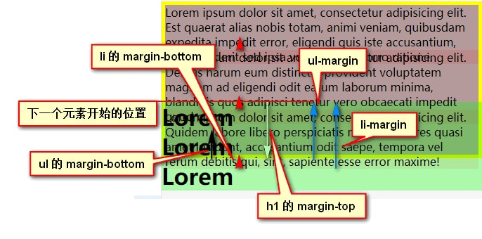

    因为 |ul 的 margin-bottom| < |h1 的 margin-top| 所以 ul-margin 为 -80
    li-margin = ul 的 border + li 的 margin-bottom + h1 的 margin-top = -95


```
归纳为:
    一. 当父( ul )子( li )兄弟( h1 )同时设置了 margin-bottom 时
        通式可以写成: ul-margin(li-margin) =  MAX(如果正,如果正,如果正) + MAX(|如果负|,|如果负|,|如果负|)

    二. 当父( ul )子( li )兄弟( h1 )同时设置了 margin-bottom 时, 且 ul 设置了 border
        1. ul-margin = MAX(如果|ul 的 margin-bottom|为正, 如果|h1 的 margin-top|为正) + MAX(如果|ul 的 margin-bottom|为负, 如果|h1 的 margin-top|为负), 也就是四个位置选两个位置填上去
        2. li-margin = ul-margin + ul 的 border + li 的 margin-bottom
```

全文总结:

    ul 无 border 时:

        ul-margin(li-margin) =  MAX(如果正,如果正,如果正) + MAX(|如果负|,|如果负|,|如果负|), 也就是六个位置选三个位置填上去

    ul 有 border 时:

        ul-margin = MAX(如果|ul 的 margin-bottom|为正, 如果|h1 的 margin-top|为正) + MAX(如果|ul 的 margin-bottom|为负, 如果|h1 的 margin-top|为负), 也就是四个位置选两个位置填上去

        li-margin = ul-margin + ul 的 border + li 的 margin-bottom

如有错误,还请诸位大佬不吝赐教,非常感谢!

联系方式:

李文康

email: changzhiliwenkang@outlook.com

github: https://liwenkang.github.io/

2018年5月13日 23:06:20
