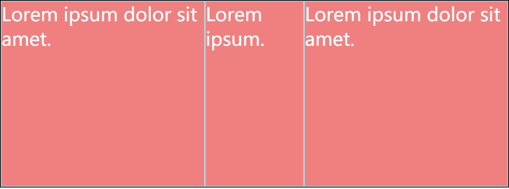

# flex 布局的用法实战

先来看 [Flex 布局教程：语法篇](http://www.ruanyifeng.com/blog/2015/07/flex-grammar.html) 留言中的一个例子
```html 
<style>
    * {
        margin: 0;
        padding: 0;
    }

    li {
        list-style-type: none;
    }

    #list {
        border: 2px solid black;
        height: 500px;
        display: flex;
        flex-direction: row;
    }

    #list li {
        font-size: 50px;
        background: lightcoral;
        color: #ffffff;
        flex-grow: 1;
        border: 2px solid lightblue;
    }

    #list li:nth-child(2) {
        flex-grow: 2;
    }
</style>

<ul id="list">
    <li>Lorem ipsum dolor sit amet.</li>
    <li>Lorem ipsum.</li>
    <li>Lorem ipsum dolor sit amet.</li>
</ul>
```

效果如下


可以看到在我们只设置了 flex-grow 的情况下, 第二个 li 的宽度并没有像我们设想的一样,变为两边元素的两倍.

这里的问题就在于因为有了文字的存在,影响了 li 的初始宽度( flex-basis )

所以我们需要设置 flex-basis 为 0,或者分别设置 flex: 1 和 flex: 2(让浏览器自己计算其他值);

```html
<style>
#list li {
    font-size: 50px;
    background: lightcoral;
    color: #ffffff;
    flex: 1;
    border: 2px solid lightblue;
}

#list li:nth-child(2) {
    flex: 2;
}
</style>
```

效果如下


接下来我们看一个神奇的居中...

```html
<style>
    * {
        margin: 0;
        padding: 0;
    }

    .parent {
        display: flex;
        height: 300px; /* Or whatever */
        border: 1px solid lightcoral;
    }

    .child {
        width: 100px;  /* Or whatever */
        height: 100px; /* Or whatever */
        margin: auto;  /* Magic! */
        border: 1px solid lightgreen;
    }
</style>

<div class="parent">
    <span class="child">Lorem ipsum dolor sit amet.</span>
    <span class="child">Lorem ipsum.</span>
    <span class="child">Lorem ipsum dolor sit amet.</span>
</div>
```

效果如下


可以看到， flex-item 在设置了 margin：auto 后，会自动撑满剩余空间，所以设置一个垂直的 margin：auto 后，就会使它在主轴和交叉轴都居中了

下面完成一个非常常见的应用，写一个导航栏。
要求屏幕较宽的时候，导航栏横向排列在屏幕的右上角；
当屏幕宽度中等的时候，导航栏横向排列在屏幕的上方，撑满宽；
当屏幕宽度很窄的时候，导航栏纵向排列在屏幕上方；

这里面借助 @media 实现响应式布局，配合 flex-flow 和 justify-content 将元素正确排列
```html
<style>
    * {
        margin: 0;
        padding: 0;
    }

    .navigation {
        list-style: none;
        margin: 0;
        background: deepskyblue;
        display: flex;
        flex-flow: row wrap;
        justify-content: flex-end;
    }

    .navigation a {
        text-decoration: none;
        display: block;
        padding: 1em;
        color: white;
    }

    .navigation a:hover {
        background: lightcoral;
    }

    @media all and (max-width: 800px) {
        .navigation {
            justify-content: space-between;
        }
    }

    @media all and (max-width: 600px) {
        .navigation {
            flex-flow: column wrap;
            padding: 0;
        }

        .navigation a {
            text-align: center;
            padding: 10px;
            border-top: 1px solid rgba(255, 255, 255, 0.3);
            border-bottom: 1px solid rgba(0, 0, 0, 0.1);
        }

        .navigation li:last-of-type a {
            border-bottom: none;
        }
    }
</style>

<ul class="navigation">
    <li><a href="#">Home</a></li>
    <li><a href="#">About</a></li>
    <li><a href="#">Products</a></li>
    <li><a href="#">Contact</a></li>
</ul>
```

接下来是经典的圣杯布局
要求屏幕较宽的时候，aside 部分宽度不变，article 是流式的

            header
     aside1 article aside2
            footer

当屏幕宽度中等的时候，撑满宽的条件下，流式

            header
            article 
        aside1 aside2
            footer

当屏幕宽度很窄的时候，撑满宽

            header
            article 
            aside1 
            aside2
            footer

```html
<style>
    * {
        margin: 0;
        padding: 0;
    }

    .wrapper {
        display: flex;
        flex-flow: row wrap;
        font-weight: bold;
        text-align: center;
    }

    .wrapper > * {
        /**
        * 注意此处设置的
        * flex-grow: 1;
        * flex-shrink: 0;
        * flex-basis: 100%;
        * 也就是说 .wrppaer 的所有直接子元素的初始宽度 flex-basis 都是 100% 父元素宽
        * 也就是每个直接子元素都是横向撑满屏幕
        * 这就是我们屏幕宽度很小的时候，显示出的效果
        */
        flex: 1 100%;
    }

    .header {
        background: tomato;
    }

    .footer {
        background: lightgreen;
    }

    .main {
        text-align: left;
        background: deepskyblue;
    }

    .aside-1 {
        background: gold;
    }

    .aside-2 {
        background: hotpink;
    }

    @media all and (min-width: 600px) {
        /**
        * 当页面宽度大于 600px 的时候，aside 部分平分多余部分
        * 这里重点是设置了 flex-basis 是 0
        */
        .aside { flex: 1 0 0; }
    }

    @media all and (min-width: 800px) {
        /**
        * 当页面宽度大于 800 px 的时候,
        * 两个 aside 和 main 按照 1：3: 1 分配多余部分
        * 这里重点是设置了 flex-basis 是 0
        * 此外，调整 aside1 的 order 使它在 main 前面
        */
        .main    { flex: 3 0 0; }
        /**
        *    flex-grow: 3;
        *    flex-shrink: 0;
        *    flex-basis: 0%;
        */
        .aside-1 { order: 1; }
        .main    { order: 2; }
        .aside-2 { order: 3; }
        .footer  { order: 4; }
    }
</style>

<div class="wrapper">
    <header class="header">Header</header>
    <article class="main">
        <p>Pellentesque habitant morbi tristique senectus et netus et malesuada fames ac turpis egestas. Vestibulum tortor quam, feugiat vitae, ultricies eget, tempor sit amet, ante. Donec eu libero sit amet quam egestas semper. Aenean ultricies mi vitae est. Mauris placerat eleifend leo.</p>
    </article>
    <aside class="aside aside-1">Aside 1</aside>
    <aside class="aside aside-2">Aside 2</aside>
    <footer class="footer">Footer</footer>
</div>
```

就下来就是色子的不同点数实现了,非常适合用 flex 实现

```css
/* 这里是为了界面的表现设置的一些 css 可以先忽略 */
    * {
        margin: 0;
        padding: 0;
        box-sizing: border-box;
    }

    html, body {
        height: 100%;
    }

    body {
        display: flex;
        align-items: center;
        justify-content: center;
        flex-wrap: wrap;
        align-content: center;
        font-family: 'Open Sans', sans-serif;
        background: linear-gradient(top, #222, #333);
    }

    [class$="face"] {
        margin: 16px;
        padding: 4px;
        background-color: #e7e7e7;
        width: 104px;
        height: 104px;
        object-fit: contain;
        box-shadow:
                inset 0 5px white,
                inset 0 -5px #bbb,
                inset 5px 0 #d7d7d7,
                inset -5px 0 #d7d7d7;
        border-radius: 10%;
    }

    .pip {
        width: 24px;
        height: 24px;
        border-radius: 50%;
        margin: 4px;
        color: #e7e7e7;
        vertical-align: center;
        text-align: center;
        background-color: #333;
        box-shadow: inset 0 3px #111, inset 0 -3px #555;
    }
```

先是单个点
```html
<div class="first-face">
    <p class="pip"></p>
</div>

<style>
/* 单个点的不同位置可以通过设置主轴和交叉轴的对齐方式实现 3 * 3 = 9 种不同方式 */
    .first-face {
        display: flex;
        justify-content: flex-start | center | flex-end;
        align-items: flex-start | center | flex-end;
    }
</style>


```

接下来是两个点
```html
<div class="second-face">
    <span class="pip"></span>
    <span class="pip mid"></span>
</div>

<style>
/** 
* 当两个点排在同一行的时候设置 align-items : (flex-start | center | flex-end)
* 可以控制 justify-content: (flex-start | space-between(两边不留空隙) | flex-end) 实现不同位置的摆放
* 如果想设置两个点在不同行，可以给单个点设置 align-self: flex-start | center | flex-end;
* 如果想设置两个点在同一列，就要改变主轴方向 flex-direction 为 column
* 然后根据要求设置 justify-content 和 align-items;
*/
    .second-face {
        display: flex;
        justify-content: space-between;
        align-items: flex-start;
    }

    .mid {
        align-self: center;
    }
</style>
```

接下来是三个点,从左向右斜放
```html
<div class="second-face">
    <span class="pip one">1</span>
    <span class="pip two">2</span>
    <span class="pip three">3</span>
</div>

<style>
/**
 * 1
 *   2
 *     3
 * 同样，通过设置 align-self 调整单个点的位置 
 */
    .three-face {
        display: flex;
        justify-content: flex-start;
        align-items: flex-start;
    }

    .two {
        align-self: center;
    }

    .three {
        align-self: flex-end;
    }
</style>
```

接下来是四个点,位于四个角落
```html
<div class="fourth-face">
    <div class="column">
        <p class="pip">1</p>
        <p class="pip">2</p>
    </div>
    <div class="column">
        <p class="pip">3</p>
        <p class="pip">4</p>
    </div>
</div>

<style>
/**
 * 1 3
 * 2 4
 * div.column 是横向排列，里面的子元素 p.pip 纵向排列
 * 这里注意 align-items 没有 space-between
 * 它仅存在于多根交叉轴的 align-content 和主轴的 justify-content 上
 */
    .fourth-face {
        display: flex;
        justify-content: space-between;
    }

    .fourth-face .column {
        display: flex;
        flex-direction: column;
        justify-content: space-between;
    }

/**
* 另一种实现方式
* 1 2
* 3 4
* div.column 是纵向排列，里面的子元素 p.pip 横向排列
* 这里注意 flex-wrap: wrap；设置换行，以及 align-content: space-between; 设置多跟交叉轴存在时的对齐方式
* div.column 要撑满父元素 flex: 1(这里的 flex-basis 推算为 0，还撑满了父元素哦!)
* 再设置 justify-content: space-between; 才起效果哦
*/
    .fourth-face {
        display: flex;
        flex-wrap: wrap;
        align-content: space-between;
    }

    .fourth-face .column {
        display: flex;
        flex: 1;
        justify-content: space-between;
    }
</style>
```

接下来时五个点，分别位于中心和四个角落
```html
<div class="five-face">
    <div class="column">
        <p class="pip">1</p>
        <p class="pip">2</p>
    </div>
    <div class="column mid">
        <p class="pip">3</p>
    </div>
    <div class="column">
        <p class="pip">4</p>
        <p class="pip">5</p>
    </div>
</div>

<style>
/**
 * 1     4
 *    3
 * 2     5
 */
    .five-face {
        display: flex;
    }

    .column {
        display: flex;
        flex-direction: column;
        justify-content: space-between;
    }

    .mid {
        justify-content: center;
    }

/** 
 * 另一种实现方式
 * 1     2
 *    3  
 * 4     5
 * 注意 .column 的 如果设置 flex: 1; 会推算为 flex: 1 1 0;(无法占满父元素的宽)
 */
    .five-face {
        display: flex;
        flex-wrap: wrap;
    }

    .column {
        display: flex;
        flex: 1 1 100%; 
        justify-content: space-between;
    }

    .mid {
        justify-content: center;
    }
</style>
```

六个 
```html
<div class="six-face">
    <div class="column">
        <p class="pip">1</p>
        <p class="pip">2</p>
        <p class="pip">3</p>
    </div>
    <div class="column">
        <p class="pip">4</p>
        <p class="pip">5</p>
        <p class="pip">6</p>
    </div>
</div>

<style>
/**
 * 1 2 3
 *   
 * 4 5 6
 */
    .six-face {
        display: flex;
        flex-direction: column;
        justify-content: space-between;
    }

    .column {
        display: flex;
        flex-direction: row;
    }

/**
 * 1    4
 * 2    5
 * 3    6
 */
    .six-face {
        display: flex;
        flex-direction: row;
        justify-content: space-between;
    }

    .column {
        display: flex;
        flex-direction: column;
    }
</style>
```

七个
```html
<div class="seven-face">
    <div class="column">
        <p class="pip">1</p>
        <p class="pip">2</p>
        <p class="pip">3</p>
    </div>
    <div class="column mid">
        <p class="pip">4</p>
    </div>
    <div class="column">
        <p class="pip">5</p>
        <p class="pip">6</p>
        <p class="pip">7</p>
    </div>
</div>


<style>
/**
 * 1  2  3
 *    4
 * 5  6  7
 */
    .seven-face {
        display: flex;
        flex-direction: column;
        justify-content: space-between;
    }

    .column {
        display: flex;
        flex-direction: row;
    }

    .mid {
        justify-content: center;
    }
</style>
```

最终总结：

    从以上实践来看，我们可以从以下角度考虑 flex 的使用
    1. 首先是主轴和交叉轴的方向要确定好
    2. 看看要不要换行
    3. 然后是主轴和交叉轴的对齐方式。注意如果只有一条交叉轴时，不可以设置 align-content。align-items 不存在 space-between/space-around/space-evenly 这些对齐方式
    4. 接下来就是 flex-item 的伸缩设置，特别要注意 flex-basis：如果你想某个方向的对齐，那要关注一下在这个方向上的 flex-item 到底有没有把父元素撑满！flex：1 有时推算出的值不一定就是符合你需求的值哦！

参考 
1. [Flex 布局教程：语法篇](http://www.ruanyifeng.com/blog/2015/07/flex-grammar.html)
2. [Flex 布局教程：实例篇](http://www.ruanyifeng.com/blog/2015/07/flex-examples.html)
3. [Flex布局原理介绍](https://alisec-ued.github.io/2017/01/03/Flex%E5%B8%83%E5%B1%80%E5%8E%9F%E7%90%86%E4%BB%8B%E7%BB%8D/)
4. [A Complete Guide to Flexbox](https://css-tricks.com/snippets/css/a-guide-to-flexbox/#flexbox-background)
5. [Flexbox Playground](https://demos.scotch.io/visual-guide-to-css3-flexbox-flexbox-playground/demos/)
6. [Getting Dicey With Flexbox](https://davidwalsh.name/flexbox-dice)
7. [Solved by Flexbox](https://philipwalton.github.io/solved-by-flexbox/)